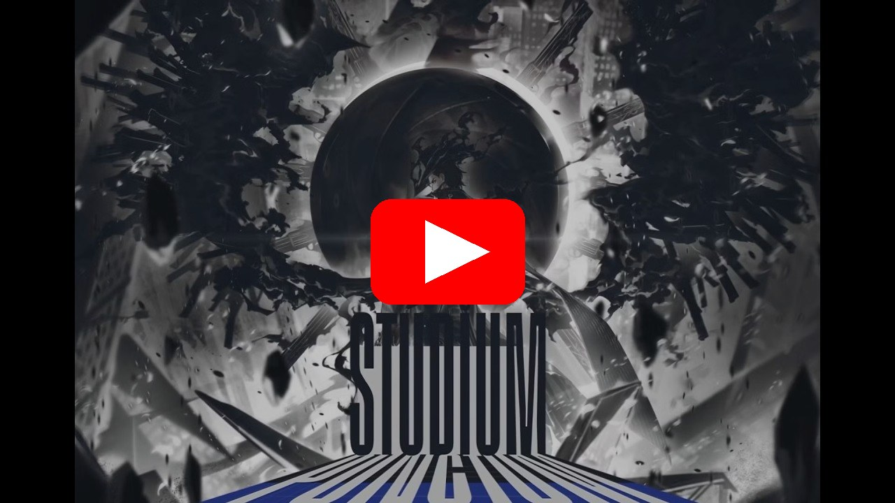

<div align="center">

# 🎬 10h vào quẩy canto 10 Limbussy

**Kênh [Kwan](https://www.youtube.com/@kwan)** &nbsp;•&nbsp; **5:22:56** &nbsp;•&nbsp; **360p gốc YouTube** &nbsp;•&nbsp; **Livestream 17/09/2026**

</div>

---

## ▶️ XEM FULL CLIP NGAY — 1 CÚ NHẤP

[](https://github.com/chikago666/kwan-lmao/blob/main/video/full-clip.mp4)

> 👆 **Bấm vào hình trên** (hoặc [vào đây](https://github.com/chikago666/kwan-lmao/blob/main/video/full-clip.mp4)) để mở **full clip 5:22:56 trong 1 file duy nhất** — GitHub sẽ phát video trực tiếp trên trang, **không cần tải về máy**.

<details>
<summary>📊 Chi tiết file full clip</summary>

| Thuộc tính | Giá trị |
|---|---|
| File | [`video/full-clip.mp4`](/chikago666/kwan-lmao/blob/main/video/full-clip.mp4) |
| Kích thước | **784 MB** (lưu bằng **Git LFS**) |
| Thời lượng | 5:22:56 (19.376 giây) |
| Định dạng | MP4 — H.264 640×360 @30fps + AAC 128kbps (nguyên bản YouTube, không re-encode) |
| Stream-friendly | ✅ faststart — phát ngay khi đang tải (progressive streaming) |

</details>

> 💡 **Mẹo:** nếu player không tự chạy trên trang file, bấm **`View raw`** — video sẽ phát trực tiếp bằng trình duyệt (Chrome/Firefox/Safari đều chạy được).
>
> ⚠️ File này lưu bằng **Git LFS** (free 1GB/tháng bandwidth) — mỗi lượt xem full tiêu tốn ~784MB bandwidth. Nếu hết quota tháng, hãy dùng tùy chọn xem theo phần bên dưới (không tốn LFS bandwidth).

---

## 🎞️ Hoặc xem theo từng phần (không cần LFS)

Video chia 11 phần, mỗi phần < 100MB, **bấm vào là xem trực tiếp trên GitHub**:

| Phần | Thời gian | Xem trực tiếp | Kích thước |
|------|-----------|---------------|------------|
| 1 | `0:00:00 → 0:16:09` | [▶ part-01.mp4](/chikago666/kwan-lmao/blob/main/video/part-01.mp4) | 55 MB |
| 2 | `0:16:09 → 0:32:21` | [▶ part-02.mp4](/chikago666/kwan-lmao/blob/main/video/part-02.mp4) | 63 MB |
| 3 | `0:32:21 → 1:04:39` | [▶ part-03.mp4](/chikago666/kwan-lmao/blob/main/video/part-03.mp4) | 90 MB |
| 4 | `1:04:39 → 1:36:57` | [▶ part-04.mp4](/chikago666/kwan-lmao/blob/main/video/part-04.mp4) | 77 MB |
| 5 | `1:36:57 → 2:09:15` | [▶ part-05.mp4](/chikago666/kwan-lmao/blob/main/video/part-05.mp4) | 73 MB |
| 6 | `2:09:15 → 2:41:33` | [▶ part-06.mp4](/chikago666/kwan-lmao/blob/main/video/part-06.mp4) | 61 MB |
| 7 | `2:41:33 → 3:13:51` | [▶ part-07.mp4](/chikago666/kwan-lmao/blob/main/video/part-07.mp4) | 59 MB |
| 8 | `3:13:51 → 3:46:08` | [▶ part-08.mp4](/chikago666/kwan-lmao/blob/main/video/part-08.mp4) | 59 MB |
| 9 | `3:46:08 → 4:18:26` | [▶ part-09.mp4](/chikago666/kwan-lmao/blob/main/video/part-09.mp4) | 64 MB |
| 10 | `4:18:26 → 4:50:44` | [▶ part-10.mp4](/chikago666/kwan-lmao/blob/main/video/part-10.mp4) | 90 MB |
| 11 | `4:50:44 → 5:22:56` | [▶ part-11.mp4](/chikago666/kwan-lmao/blob/main/video/part-11.mp4) | 92 MB |

---

## 📥 Tải về máy

```bash
# Cả repo (nhớ cài git-lfs: https://git-lfs.com)
git lfs install
git clone https://github.com/chikago666/kwan-lmao.git

# Hoặc tải từng file trong thư mục video/ trực tiếp trên web
```

---

## ℹ️ Thông tin video

- **Tiêu đề:** 10h vào quẩy canto 10 Limbussy
- **Kênh:** [Kwan](https://www.youtube.com/@kwan) — 65.5K subscribers • [Fanpage](https://www.facebook.com/justkwanthings)
- **Thể loại:** Gaming
- **Lượt xem lúc lưu trữ:** ~18.551
- **Nguồn gốc:** [youtube.com/live/Bg6__5awIeE](https://www.youtube.com/live/Bg6__5awIeE)

> ⚠️ Video được lưu trữ nhằm mục đích cá nhân / lưu trữ. Vui lòng tôn trọng bản quyền của kênh **Kwan**. Muốn xem chất lượng cao nhất, hãy truy cập [bản gốc trên YouTube](https://www.youtube.com/live/Bg6__5awIeE).
