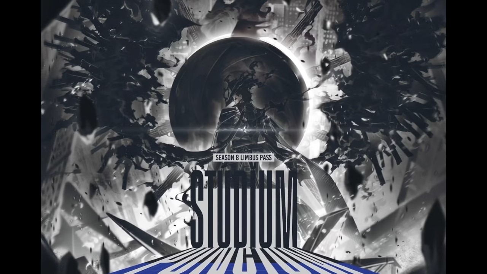

# 🎬 10h vào quẩy canto 10 Limbussy

**Kênh:** [Kwan](https://www.youtube.com/@kwan) &nbsp;•&nbsp; **Thời lượng:** 5:22:56 &nbsp;•&nbsp; **Chất lượng:** 360p (gốc YouTube) &nbsp;•&nbsp; **Phát trực tiếp:** 17/09/2026

🎥 **[Xem bản gốc trên YouTube](https://www.youtube.com/live/Bg6__5awIeE)**

---

## ▶️ Xem ngay tại đây — không cần tải về

Video đã được lưu trữ ngay trong repo này (chia 11 phần, mỗi phần < 100MB).
**Chỉ cần nhấp vào nút play bên dưới là xem được ngay trên GitHub.** 👇

### 🎞️ Phần 1 — `0:00:00 → 0:16:09`

### 🎞️ Phần 2 — `0:16:09 → 0:32:21`

### 🎞️ Phần 3 — `0:32:21 → 1:04:39`

### 🎞️ Phần 4 — `1:04:39 → 1:36:57`

### 🎞️ Phần 5 — `1:36:57 → 2:09:15`

### 🎞️ Phần 6 — `2:09:15 → 2:41:33`

### 🎞️ Phần 7 — `2:41:33 → 3:13:51`

### 🎞️ Phần 8 — `3:13:51 → 3:46:08`

### 🎞️ Phần 9 — `3:46:08 → 4:18:26`

### 🎞️ Phần 10 — `4:18:26 → 4:50:44`

### 🎞️ Phần 11 — `4:50:44 → 5:22:56` (hết)

---

## 📦 Danh sách file

| # | File | Thời lượng | Kích thước | Bắt đầu từ |
|---|------|-----------|-----------|------------|
| 1 | [`video/part-01.mp4`](video/part-01.mp4) | 16:09 | 55 MB | `0:00:00` |
| 2 | [`video/part-02.mp4`](video/part-02.mp4) | 16:12 | 63 MB | `0:16:09` |
| 3 | [`video/part-03.mp4`](video/part-03.mp4) | 32:18 | 90 MB | `0:32:21` |
| 4 | [`video/part-04.mp4`](video/part-04.mp4) | 32:18 | 77 MB | `1:04:39` |
| 5 | [`video/part-05.mp4`](video/part-05.mp4) | 32:18 | 73 MB | `1:36:57` |
| 6 | [`video/part-06.mp4`](video/part-06.mp4) | 32:18 | 61 MB | `2:09:15` |
| 7 | [`video/part-07.mp4`](video/part-07.mp4) | 32:17 | 59 MB | `2:41:33` |
| 8 | [`video/part-08.mp4`](video/part-08.mp4) | 32:18 | 59 MB | `3:13:51` |
| 9 | [`video/part-09.mp4`](video/part-09.mp4) | 32:18 | 64 MB | `3:46:08` |
| 10 | [`video/part-10.mp4`](video/part-10.mp4) | 32:18 | 90 MB | `4:18:26` |
| 11 | [`video/part-11.mp4`](video/part-11.mp4) | 32:14 | 92 MB | `4:50:44` |

> 💡 **Mẹo:** Cần tải cả video về máy? Vào folder [`video/`](video) rồi tải từng file, hoặc dùng `git clone`.

---

## ℹ️ Thông tin video

- **Tiêu đề:** 10h vào quẩy canto 10 Limbussy
- **Kênh:** [Kwan](https://www.youtube.com/@kwan) — 65.5K subscribers
- **Fanpage:** [facebook.com/justkwanthings](https://www.facebook.com/justkwanthings)
- **Thể loại:** Gaming
- **Lượt xem lúc lưu trữ:** ~18.551
- **Nguồn gốc:** [youtube.com/live/Bg6__5awIeE](https://www.youtube.com/live/Bg6__5awIeE)
- **Định dạng lưu trữ:** MP4 (H.264 640×360 @30fps + AAC 128kbps) — nguyên bản từ YouTube, không re-encode

> ⚠️ Video được lưu trữ nhằm mục đích cá nhân / lưu trữ. Vui lòng tôn trọng bản quyền của kênh **Kwan**. Muốn xem chất lượng cao nhất, hãy truy cập [bản gốc trên YouTube](https://www.youtube.com/live/Bg6__5awIeE).
