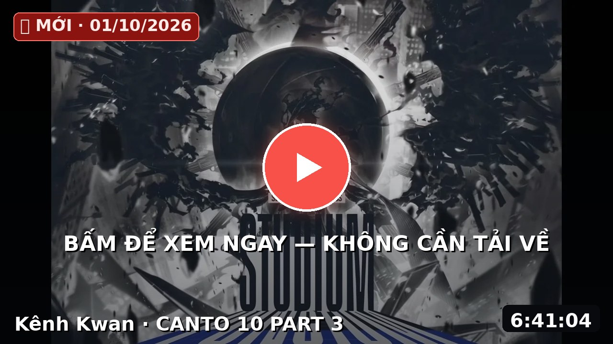
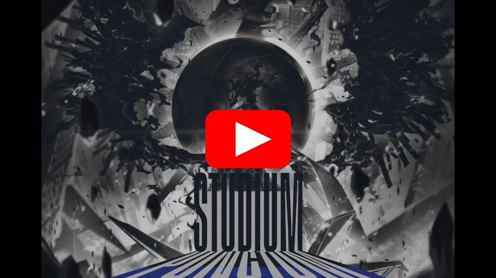

<div align="center">

# 🎬 Kwan — Lưu trữ Livestream

Kho lưu trữ livestream của kênh **[Kwan](https://www.youtube.com/@kwan)** — xem trực tiếp ngay trên GitHub, **không cần tải về máy**.

**2 stream:** 🔴 *Canto 10 Part 3* (01/10/2026) &nbsp;•&nbsp; 📺 *10h quẩy Canto 10* (17/09/2026)

</div>

---

## 🔴 MỚI — LIVE FULL CANTO 10 PART 3 LET'S GOOOOOO LIMBUSSYYY

**Kênh [Kwan](https://www.youtube.com/@kwan)** &nbsp;•&nbsp; **6:41:04** &nbsp;•&nbsp; **360p gốc YouTube** &nbsp;•&nbsp; **Livestream 01/10/2026**

### ▶️ XEM TRỰC TIẾP — 1 CÚ NHẤP

[](https://chikago666.github.io/kwan-lmao/)

> 👆 **Bấm vào hình trên** (hoặc [vào đây](https://chikago666.github.io/kwan-lmao/)) — trang xem video mở ngay,
> bấm ▶ là **cả clip 6 giờ 41 phút chạy liền mạch, không cần tải về** gì cả.
>
> - **Chế độ Full (1 file):** video chạy như 1 file duy nhất, tua tự do bất kỳ lúc nào.
> - **Chế độ 22 phần:** nếu mạng chậm, bấm chuyển sang 22 phần — tự động phát nối tiếp, không cần bấm tiếp.
> - Vị trí xem dở được **tự ghi nhớ** — quay lại sau bấm "Tiếp tục" là chạy tiếp.

<details>
<summary>⚙️ Trang xem không mở được? (chỉ dành cho chủ repo — cấu hình 1 lần)</summary>

Trang xem chạy trên **GitHub Pages** của repo này. Nếu link trả về 404, bật 2 thứ trong Settings của repo:

1. **Repo phải ở chế độ Public:** `Settings → General → Danger Zone → Change visibility → Public`
2. **Bật Pages:** `Settings → Pages → Source: Deploy from a branch → Branch: main, thư mục: /docs → Save`

Sau ~1 phút GitHub build xong, link `https://chikago666.github.io/kwan-lmao/` sẽ chạy.

</details>

---

## 🎞️ Xem / nhảy tới từng phần — Canto 10 Part 3

Bấm số phần để mở **ngay tại đoạn đó** trên trang xem (tự động chuyển sang chế độ 22 phần):

| Phần | Thời gian | Xem từ đoạn này | Tải raw |
|------|-----------|-----------------|---------|
| 1 | `0:00:00 → 0:21:02` | [▶ Phần 1](https://chikago666.github.io/kwan-lmao/#v=canto10p3&part=1) | [⬇ 59 MB](https://raw.githubusercontent.com/chikago666/kwan-lmao/main/video-canto10-part3/part-01.mp4) |
| 2 | `0:21:02 → 0:42:07` | [▶ Phần 2](https://chikago666.github.io/kwan-lmao/#v=canto10p3&part=2) | [⬇ 73 MB](https://raw.githubusercontent.com/chikago666/kwan-lmao/main/video-canto10-part3/part-02.mp4) |
| 3 | `0:42:07 → 1:03:04` | [▶ Phần 3](https://chikago666.github.io/kwan-lmao/#v=canto10p3&part=3) | [⬇ 98 MB](https://raw.githubusercontent.com/chikago666/kwan-lmao/main/video-canto10-part3/part-03.mp4) |
| 4 | `1:03:04 → 1:24:02` | [▶ Phần 4](https://chikago666.github.io/kwan-lmao/#v=canto10p3&part=4) | [⬇ 78 MB](https://raw.githubusercontent.com/chikago666/kwan-lmao/main/video-canto10-part3/part-04.mp4) |
| 5 | `1:24:02 → 1:45:03` | [▶ Phần 5](https://chikago666.github.io/kwan-lmao/#v=canto10p3&part=5) | [⬇ 100 MB](https://raw.githubusercontent.com/chikago666/kwan-lmao/main/video-canto10-part3/part-05.mp4) |
| 6 | `1:45:03 → 2:06:06` | [▶ Phần 6](https://chikago666.github.io/kwan-lmao/#v=canto10p3&part=6) | [⬇ 103 MB](https://raw.githubusercontent.com/chikago666/kwan-lmao/main/video-canto10-part3/part-06.mp4) |
| 7 | `2:06:06 → 2:27:05` | [▶ Phần 7](https://chikago666.github.io/kwan-lmao/#v=canto10p3&part=7) | [⬇ 65 MB](https://raw.githubusercontent.com/chikago666/kwan-lmao/main/video-canto10-part3/part-07.mp4) |
| 8 | `2:27:05 → 2:48:07` | [▶ Phần 8](https://chikago666.github.io/kwan-lmao/#v=canto10p3&part=8) | [⬇ 89 MB](https://raw.githubusercontent.com/chikago666/kwan-lmao/main/video-canto10-part3/part-08.mp4) |
| 9 | `2:48:07 → 3:09:00` | [▶ Phần 9](https://chikago666.github.io/kwan-lmao/#v=canto10p3&part=9) | [⬇ 87 MB](https://raw.githubusercontent.com/chikago666/kwan-lmao/main/video-canto10-part3/part-09.mp4) |
| 10 | `3:09:00 → 3:30:04` | [▶ Phần 10](https://chikago666.github.io/kwan-lmao/#v=canto10p3&part=10) | [⬇ 100 MB](https://raw.githubusercontent.com/chikago666/kwan-lmao/main/video-canto10-part3/part-10.mp4) |
| 11 | `3:30:04 → 3:40:37` | [▶ Phần 11](https://chikago666.github.io/kwan-lmao/#v=canto10p3&part=11) | [⬇ 54 MB](https://raw.githubusercontent.com/chikago666/kwan-lmao/main/video-canto10-part3/part-11.mp4) |
| 12 | `3:40:37 → 3:51:06` | [▶ Phần 12](https://chikago666.github.io/kwan-lmao/#v=canto10p3&part=12) | [⬇ 54 MB](https://raw.githubusercontent.com/chikago666/kwan-lmao/main/video-canto10-part3/part-12.mp4) |
| 13 | `3:51:06 → 4:12:06` | [▶ Phần 13](https://chikago666.github.io/kwan-lmao/#v=canto10p3&part=13) | [⬇ 77 MB](https://raw.githubusercontent.com/chikago666/kwan-lmao/main/video-canto10-part3/part-13.mp4) |
| 14 | `4:12:06 → 4:33:01` | [▶ Phần 14](https://chikago666.github.io/kwan-lmao/#v=canto10p3&part=14) | [⬇ 59 MB](https://raw.githubusercontent.com/chikago666/kwan-lmao/main/video-canto10-part3/part-14.mp4) |
| 15 | `4:33:01 → 4:54:04` | [▶ Phần 15](https://chikago666.github.io/kwan-lmao/#v=canto10p3&part=15) | [⬇ 82 MB](https://raw.githubusercontent.com/chikago666/kwan-lmao/main/video-canto10-part3/part-15.mp4) |
| 16 | `4:54:04 → 5:15:04` | [▶ Phần 16](https://chikago666.github.io/kwan-lmao/#v=canto10p3&part=16) | [⬇ 69 MB](https://raw.githubusercontent.com/chikago666/kwan-lmao/main/video-canto10-part3/part-16.mp4) |
| 17 | `5:15:04 → 5:25:34` | [▶ Phần 17](https://chikago666.github.io/kwan-lmao/#v=canto10p3&part=17) | [⬇ 48 MB](https://raw.githubusercontent.com/chikago666/kwan-lmao/main/video-canto10-part3/part-17.mp4) |
| 18 | `5:25:34 → 5:36:05` | [▶ Phần 18](https://chikago666.github.io/kwan-lmao/#v=canto10p3&part=18) | [⬇ 58 MB](https://raw.githubusercontent.com/chikago666/kwan-lmao/main/video-canto10-part3/part-18.mp4) |
| 19 | `5:36:05 → 5:57:00` | [▶ Phần 19](https://chikago666.github.io/kwan-lmao/#v=canto10p3&part=19) | [⬇ 55 MB](https://raw.githubusercontent.com/chikago666/kwan-lmao/main/video-canto10-part3/part-19.mp4) |
| 20 | `5:57:00 → 6:18:03` | [▶ Phần 20](https://chikago666.github.io/kwan-lmao/#v=canto10p3&part=20) | [⬇ 47 MB](https://raw.githubusercontent.com/chikago666/kwan-lmao/main/video-canto10-part3/part-20.mp4) |
| 21 | `6:18:03 → 6:39:02` | [▶ Phần 21](https://chikago666.github.io/kwan-lmao/#v=canto10p3&part=21) | [⬇ 54 MB](https://raw.githubusercontent.com/chikago666/kwan-lmao/main/video-canto10-part3/part-21.mp4) |
| 22 | `6:39:02 → 6:41:04` | [▶ Phần 22](https://chikago666.github.io/kwan-lmao/#v=canto10p3&part=22) | [⬇ 7 MB](https://raw.githubusercontent.com/chikago666/kwan-lmao/main/video-canto10-part3/part-22.mp4) |

---

## 📥 Tải về máy — Canto 10 Part 3

**Cách 1 — chỉ 1 file (khuyên dùng):** [full-clip-canto10-part3.mp4 (1.5 GB)](https://github.com/chikago666/kwan-lmao/releases/download/canto10-part3/full-clip-canto10-part3.mp4) — từ [Release](https://github.com/chikago666/kwan-lmao/releases/tag/canto10-part3), tải nhanh qua CDN GitHub, không giới hạn băng thông.

**Cách 2 — tải từng phần:** dùng cột "Tải raw" trong bảng 22 phần ở trên (mỗi phần 45–103 MB).

**Cách 3 — clone cả repo** (~2.3 GB, đủ cả 2 stream):

```bash
git clone https://github.com/chikago666/kwan-lmao.git
```

---

## 📺 Stream trước: 10h vào quẩy canto 10 Limbussy (5:22:56)

[](https://chikago666.github.io/kwan-lmao/#v=marathon)

> Livestream **17/09/2026** — bấm vào hình để mở trang xem (đủ cả 2 tab video, có sẵn chế độ Full / 11 phần).

| Phần | Thời gian | Xem từ đoạn này | Tải raw |
|------|-----------|-----------------|---------|
| 1 | `0:00:00 → 0:16:09` | [▶ Phần 1](https://chikago666.github.io/kwan-lmao/#v=marathon&part=1) | [⬇ 55 MB](https://raw.githubusercontent.com/chikago666/kwan-lmao/main/video/part-01.mp4) |
| 2 | `0:16:09 → 0:32:21` | [▶ Phần 2](https://chikago666.github.io/kwan-lmao/#v=marathon&part=2) | [⬇ 63 MB](https://raw.githubusercontent.com/chikago666/kwan-lmao/main/video/part-02.mp4) |
| 3 | `0:32:21 → 1:04:39` | [▶ Phần 3](https://chikago666.github.io/kwan-lmao/#v=marathon&part=3) | [⬇ 90 MB](https://raw.githubusercontent.com/chikago666/kwan-lmao/main/video/part-03.mp4) |
| 4 | `1:04:39 → 1:36:57` | [▶ Phần 4](https://chikago666.github.io/kwan-lmao/#v=marathon&part=4) | [⬇ 77 MB](https://raw.githubusercontent.com/chikago666/kwan-lmao/main/video/part-04.mp4) |
| 5 | `1:36:57 → 2:09:15` | [▶ Phần 5](https://chikago666.github.io/kwan-lmao/#v=marathon&part=5) | [⬇ 73 MB](https://raw.githubusercontent.com/chikago666/kwan-lmao/main/video/part-05.mp4) |
| 6 | `2:09:15 → 2:41:33` | [▶ Phần 6](https://chikago666.github.io/kwan-lmao/#v=marathon&part=6) | [⬇ 61 MB](https://raw.githubusercontent.com/chikago666/kwan-lmao/main/video/part-06.mp4) |
| 7 | `2:41:33 → 3:13:51` | [▶ Phần 7](https://chikago666.github.io/kwan-lmao/#v=marathon&part=7) | [⬇ 59 MB](https://raw.githubusercontent.com/chikago666/kwan-lmao/main/video/part-07.mp4) |
| 8 | `3:13:51 → 3:46:08` | [▶ Phần 8](https://chikago666.github.io/kwan-lmao/#v=marathon&part=8) | [⬇ 59 MB](https://raw.githubusercontent.com/chikago666/kwan-lmao/main/video/part-08.mp4) |
| 9 | `3:46:08 → 4:18:26` | [▶ Phần 9](https://chikago666.github.io/kwan-lmao/#v=marathon&part=9) | [⬇ 64 MB](https://raw.githubusercontent.com/chikago666/kwan-lmao/main/video/part-09.mp4) |
| 10 | `4:18:26 → 4:50:44` | [▶ Phần 10](https://chikago666.github.io/kwan-lmao/#v=marathon&part=10) | [⬇ 90 MB](https://raw.githubusercontent.com/chikago666/kwan-lmao/main/video/part-10.mp4) |
| 11 | `4:50:44 → 5:22:56` | [▶ Phần 11](https://chikago666.github.io/kwan-lmao/#v=marathon&part=11) | [⬇ 92 MB](https://raw.githubusercontent.com/chikago666/kwan-lmao/main/video/part-11.mp4) |

📥 Tải 1 file: [full-clip.mp4 (784 MB)](https://github.com/chikago666/kwan-lmao/releases/download/full-video/full-clip.mp4) — từ [Release](https://github.com/chikago666/kwan-lmao/releases/tag/full-video).

---

## ℹ️ Thông tin lưu trữ

### 🔴 LIVE FULL CANTO 10 PART 3 LET'S GOOOOOO LIMBUSSYYY

| | |
|---|---|
| **Kênh** | [Kwan](https://www.youtube.com/@kwan) — 65.7K subscribers • [Fanpage](https://www.facebook.com/justkwanthings) |
| **Thể loại** | Gaming (Limbus Company — Canto 10) |
| **Lượt xem lúc lưu trữ** | ~15.179 |
| **Nguồn gốc** | [youtube.com/live/bHLdm2GD3AY](https://www.youtube.com/live/bHLdm2GD3AY) |
| **Định dạng lưu trữ** | MP4 — H.264 640×360 @30fps + AAC, nguyên bản YouTube 360p (không re-encode, faststart) |

### 📺 10h vào quẩy canto 10 Limbussy

| | |
|---|---|
| **Nguồn gốc** | [youtube.com/live/Bg6__5awIeE](https://www.youtube.com/live/Bg6__5awIeE) |
| **Định dạng lưu trữ** | MP4 — H.264 640×360 @30fps + AAC 128kbps (nguyên bản YouTube, faststart) |
| **Lượt xem lúc lưu trữ** | ~18.551 |

---

> ⚠️ Toàn bộ video được lưu trữ nhằm mục đích cá nhân / lưu trữ. Vui lòng tôn trọng bản quyền của kênh **Kwan**.
> Muốn xem chất lượng cao nhất, hãy truy cập bản gốc trên YouTube:
> [Canto 10 Part 3](https://www.youtube.com/live/bHLdm2GD3AY) · [10h quẩy Canto 10](https://www.youtube.com/live/Bg6__5awIeE).
